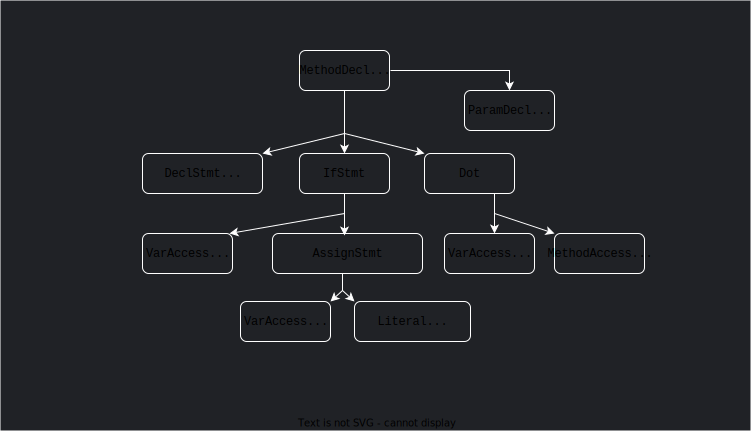
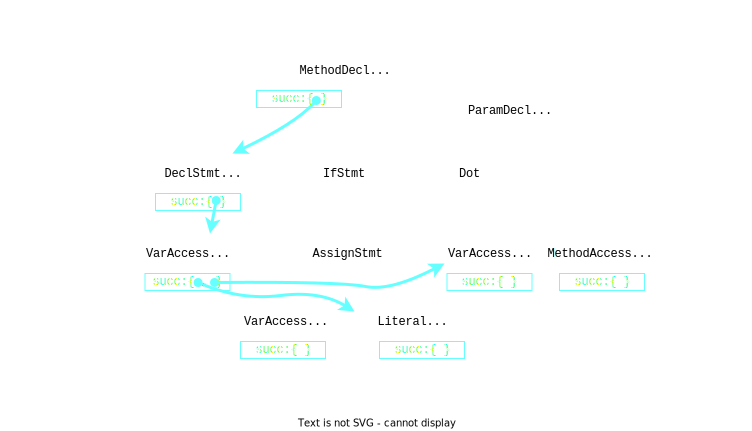
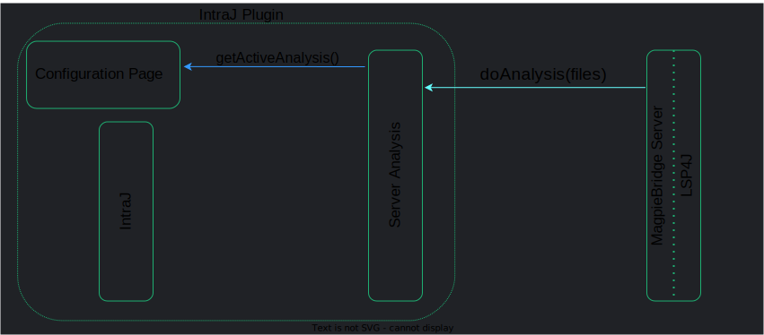
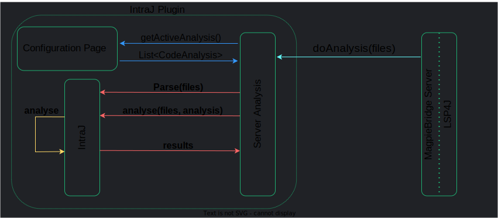

---
# try also 'default' to start simple
theme: codeg
# random image from a curated Unsplash collection by Anthony
# like them? see https://unsplash.com/collections/94734566/slidev
background: https://source.unsplash.com/collection/94734566/1920x1080
# apply any windi css classes to the current slide
class: 'text-center'
# https://sli.dev/custom/highlighters.html
highlighter: prism
# show line numbers in code blocks
lineNumbers: true
# some information about the slides, markdown enabled
info: |
  ## Source-level dataflow-based fixes: experiences from using IntraJ and MagpieBridge
  Idriss Riouak


# persist drawings in exports and build
drawings:
  persist: false
---

# Source-level 

# Dataflow-based fixes

## Experiences from using IntraJ and MagpieBridge

Idriss Riouak - Lund University


<div class="abs-br m-6 flex gap-2">
 <a href="https://github.com/slidevjs/slidev" target="_blank" alt="GitHub"
    class="text-xl icon-btn opacity-50 !border-none !hover:text-white">
     
  </a>
  <a href="https://github.com/slidevjs/slidev" target="_blank" alt="GitHub"
    class="text-xl icon-btn opacity-50 !border-none !hover:text-white">
    <carbon-logo-github />
  </a>
</div>

<!--
The last comment block of each slide will be treated as slide notes. It will be visible and editable in Presenter Mode along with the slide. [Read more in the docs](https://sli.dev/guide/syntax.html#notes)
-->

---

# Example Dataflow-based analyses

<div   v-click="1" grid="~ cols-2 gap-2" m="-t-2">

```java
void foo(boolean b){
  String x = null;
  if(b) x = "Hello World";
  x.toString();
}
```

<div>

### Null pointer Analysis (NPA)


<br>
<br>
<p v-click="2">
⚠️ Possible <code style="color:red">NullPointerException</code> at line 4
</p>

<arrow v-click="2"  x1="600" y1="200" x2="260" y2="200" color="red" width="1.5" arrowSize="1" />

</div>
</div>

<div  v-click="3" grid="~ cols-2 gap-2" m="-t-2">

```java
private int hash = 0;
int hashFunc(){
  if(hash==0){
    int hash = 10;
    //Complex operations on  hash
    hash += 10;
  }
  return hash;
}
```

<div>

### Dead Assignment Analysis (DAA)

###### Simplified example from Apache FOP (90 KLOC)


<br><br>

<p v-click="4">
⚠️ <code style="color:red">Dead Assignment</code> at line 6. The value of <code style="color:red">hash</code> is never read.
</p>
<arrow v-click="4"  x1="600" y1="400" x2="260" y2="400" color="red" width="1.5" arrowSize="1" />
</div>

</div>

<!--
You can have `style` tag in markdown to override the style for the current page.
Learn more: https://sli.dev/guide/syntax#embedded-styles
-->

---


# The big picture


---

# The big picture


---

# The big picture


---

# The big picture


---


# The big picture


---

# The big picture


---

# The big picture


---


# The big picture


---

# The big picture


---

# Reference Attribute Grammars 


<div  grid="~ cols-2 gap-2" m="-t-2">

```java
void foo(boolean b){
  String x = null;
  if(b) x = "Hello World";
  x.toString();
}
```
</div>



---


# Reference Attribute Grammars 

<div  grid="~ cols-2 gap-2" m="-t-2">

```java
void foo(boolean b){
  String x = null;
  if(b) x = "Hello World";
  x.toString();
}
```
</div>


---


# Reference Attribute Grammars 

<div  grid="~ cols-2 gap-2" m="-t-2">

```java
void foo(boolean b){
  String x = null;
  if(b) x = "Hello World";
  x.toString();
}
```
</div>


---


# Reference Attribute Grammars 

<div  grid="~ cols-2 gap-2" m="-t-2">

```java
void foo(boolean b){
  String x = null;
  if(b) x = "Hello World";
  x.toString();
}
```
</div>


---


# Reference Attribute Grammars 

<div  grid="~ cols-2 gap-2" m="-t-2">

```java
void foo(boolean b){
  String x = null;
  if(b) x = "Hello World";
  x.toString();
}
```
</div>


---

# Reference Attribute Grammars 

<div  grid="~ cols-2 gap-2" m="-t-2">

```java
void foo(boolean b){
  String x = null;
  if(b) x = "Hello World";
  x.toString();
}
```
</div>


---

# Reference Attribute Grammars 

<div  grid="~ cols-2 gap-2" m="-t-2">

```java
void foo(boolean b){
  String x = null;
  if(b) x = "Hello World";
  x.toString();
}
```
</div>


---
# Reference Attribute Grammars 

<div  grid="~ cols-2 gap-2" m="-t-2">

```java
void foo(boolean b){
  String x = null;
  if(b) x = "Hello World";
  x.toString();
}
```
</div>


---

# Reference Attribute Grammars 

<div  grid="~ cols-2 gap-2" m="-t-2">

```java
void foo(boolean b){
  String x = null;
  if(b) x = "Hello World";
  x.toString();
}
```
</div>


---


# Reference Attribute Grammars 

<div  grid="~ cols-2 gap-2" m="-t-2">

```java
void foo(boolean b){
  String x = null;
  if(b) x = "Hello World";
  x.toString();
}
```
</div>


---


# Reference Attribute Grammars 

<div  grid="~ cols-2 gap-2" m="-t-2">

```java
void foo(boolean b){
  String x = null;
  if(b) x = "Hello World";
  x.toString();
}
```
</div>


---

# Reference Attribute Grammars 

<div  grid="~ cols-2 gap-2" m="-t-2">

<div>

```java
void foo(boolean b){
  String x = null;
  if(b) x = "Hello World";
  x.toString();
}
```

* JastAdd ecosystem
   * On-demand evaluation
   * Fix point computation
   * Higher-Order Attributes
  


</div>
</div>


---


# Null Pointer Analysis

<div  grid="~ cols-2 gap-2" m="-t-2">

```java
void foo(boolean b){
  String x = null;
  if(b) x = "Hello World";
  x.toString();
}
```
</div>


---


# Null Pointer Analysis

<div  grid="~ cols-2 gap-2" m="-t-2">

```java
void foo(boolean b){
  String x = null;
  if(b) x = "Hello World";
  x.toString();
}
```
</div>


---


#   IntraJ


<div>

* Builds the CFGs on the AST
* Handles **_implicit control-flows_**
* Analyses competitive with existing tools e.g., **_SonarQube_**

<br>
<h2 style="position:fixed; left:30%">If you want to know more ...</h2>


<div  grid="~ cols-2 gap-2" m="-t-2">

<div>


<br><br><br>


<h2 style="position:relative; left:130px">GitHub</h2>
</div>

<div>


<br><br><br>


<h2 style="position:relative; left:140px">Paper</h2>
</div>


</div>

</div>
---

# The big picture, again


---


# Zoom-in


---


# Zoom-in


---


# Zoom-in



---


# Zoom-in


---


# Zoom-in


---


# Zoom-in


---


# Zoom-in


---


# Zoom-in




---


# Zoom-in


---


# Example: quick fix (warning)


---

# Example: quick fix 


---


# Example: bug explanation


---

# Tip of the Iceberg


---

# Overall experience

* Intuitive and easy to use
* Concise specification of the server
* Well documented
* With the scaffolding we provide, adding support for a new analysis is trivial:


```java
public class YourAnalysis extends CodeAnalysis {
  public String getName() { return "YourAnalysis"; }
  protected Set<Warning> getWarnings(CompilationUnit cu) 
    { return cu.yourAnalysis(); }  //<--  Property triggered by the analysis
}
```

```java
activeAnalyses.put(new YourAnalysis(), true); //Register the analysis
```

* Plugin V 0.0.1 made by Charlie Mrad (Master Student @ LU)


---

# On-demand evaluation

We are able to run analyeses on-demand 👍


But we construct all *fixes* and *motivations* ahead-of-time because

  * Hover 
  * CodeLens
  
are not exposed to **ServerAnalysis**


  
 
---

# Looking forward for ...
## Not only warnings

<br>


---

# Thank you for your attention !

<div  grid="~ cols-3 gap-2" m="-t-2">

<div>


<br><br><br>


<h2 style="position:relative; left:80px">GitHub</h2>
</div>

<div>


<br><br><br>


<h2 style="position:relative; left:90px">Paper</h2>
</div>

<div>


<br><br><br>


<h2 style="position:relative; left:65px">Extension</h2>
</div>


</div>

---

# Motivations: source-level
<div  grid="~ cols-2 gap-2" m="-t-2">
<div>
```java {all}
void foo(boolean b){
  String x = null;
  if(b) x = "Hello World";
  x.toString();
}
```


### Advantages
  1) Error are directly linked to the source code
  2) Works with broken code
  3) Easier integration with IDEs

### Disadvantages
  1) Bigger language
  2) Source-code contains implicit facts

</div>
```java {all}
  void foo(java.lang.boolean);
    Code:
       0: aconst_null
       1: astore_2
       2: aload_1
       3: invokevirtual #2
       6: ifeq          12
       9: ldc           #3
      11: astore_2
      12: aload_2
      13: invokevirtual #4
      16: pop
      17: return
```
</div>

---

# Precision: numbers


---

# Precision: numbers


DeadAssignmentAnalysis: IntraJ detects everything that SonarQube detects
---

# Precision: numbers


DeadAssignmentAnalysis: IntraJ detects everything that SonarQube detects

NullPointerAnalysis: SonarQube is more precise but IntraJ remains competitive
---

# Performace

1. No dealy in the previous demo


